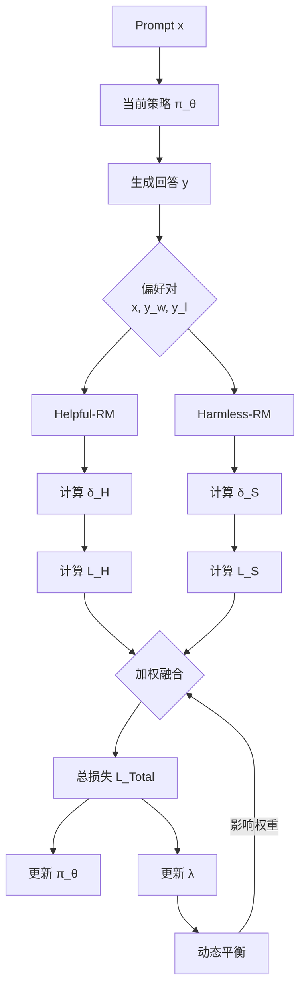

# 基于Safe-RLHF与MM-DPO的语言模型价值对齐

## 项目概述

**核心目标**：实现一个大型语言模型与人类价值观的有效对齐，使其在保持“有帮助”的同时，确保“无害”。

**设计思路**：

1.  **对齐**：结合Safe RLHF的约束优化思想与MM-RLHF的MM-DPO算法，训练一个安全且有用的模型。
2.  **蒸馏**：利用Zephyr论文中的蒸馏技术，将对齐后的大模型压缩为更小的模型，以探讨性能与效率的权衡。
3.  **评估**：使用精选的基准测试，系统评估模型在“安全性”和“有用性”上的表现。

**技术路线图**：
```
[基础模型] --(MM-DPO对齐)--> [对齐后模型] --(知识蒸馏)--> [轻量级模型]
                                   |                        |
                               [对齐后评估]               [蒸馏后评估]
```

## 1. 背景与动机

大型语言模型在生成内容时，可能在“有帮助”和“无害”之间产生内在冲突。
*   **有帮助**：提供用户所需的信息，即使该信息可能是有害的（如制造炸弹的步骤）。
*   **无害**：拒绝生成任何有害、有偏见或不安全的内容，即使这会让回答显得不完整或不有用。

传统的RLHF方法尝试用一个单一的奖励模型来平衡这两个目标，但这常常导致混淆和次优的平衡。我们的项目旨在通过更先进的对齐范式来解决这一根本矛盾。

## 2. 核心技术原理

我们的方法主要融合了两篇论文的思想：

### 2.1 来自 Safe RLHF 的核心思想：目标解耦与约束优化

Safe RLHF的关键创新在于将“有帮助”和“无害”视为两个独立的目标。

**1. 偏好建模的解耦**：
*   我们训练两个独立的模型：
    *   **奖励模型 $R_{\phi}(y, x)$**：专门评估回答 $y$ 对于提示 $x$ 的“有帮助”程度。
    *   **成本模型 $C_{\psi}(y, x)$**：专门评估回答 $y$ 的“有害”程度。

**2. 约束优化问题**：
我们将对齐问题形式化为一个带约束的强化学习问题：
$$
\underset{\theta}{\text{maximize}} \; \mathbb{E}_{x\sim\mathcal{D}, y\sim\pi_{\theta}(\cdot|x)} \left[ R_{\phi}(y, x) \right], \quad \text{s.t.} \; \mathbb{E}_{x\sim\mathcal{D}, y\sim\pi_{\theta}(\cdot|x)} \left[ C_{\psi}(y, x) \right] \leq 0
$$

*   **目标**：最大化期望奖励（有帮助性）。
*   **约束**：期望成本（有害性）必须低于一个阈值（这里设为0）。

**3. 拉格朗日对偶**：
我们使用拉格朗日乘子法将这个有约束问题转化为无约束的优化问题：
$$
\mathcal{L}(\theta, \lambda) = -\mathcal{J}_{R}(\theta) + \lambda \cdot \mathcal{J}_{C}(\theta)
$$
其中 $\lambda$ 是拉格朗日乘子。通过迭代更新策略 $\pi_{\theta}$ 和乘子 $\lambda$，模型可以动态地平衡两个目标。当模型有害时 ($\mathcal{J}_{C} > 0$)，$\lambda$ 增大，惩罚增强；当模型安全时 ($\mathcal{J}_{C} \leq 0$)，$\lambda$ 减小，专注于提升有帮助性。

### 2.2 来自 MM-RLHF 的核心创新：MM-DPO 与动态奖励缩放

直接实现Safe RLHF的三阶段训练（训练RM/CM，然后RL）成本高昂。因此，我们采用MM-RLHF中提出的MM-DPO算法，它是对DPO的增强，更适合我们的场景。

**1. DPO基础**：
DPO绕过了显式的奖励模型训练，通过一个巧妙的数学推导，直接使用偏好数据优化策略模型。给定一个偏好对 $(x, y_w, y_l)$，其中 $y_w$ 优于 $y_l$，DPO的损失函数为：
$$
\mathcal{L}_{\text{DPO}}(\pi_{\theta}; \pi_{\text{ref}}) = -\mathbb{E}_{(x, y_w, y_l) \sim \mathcal{D}} \left[ \log \sigma \left( \beta \log \frac{\pi_{\theta}(y_w | x)}{\pi_{\text{ref}}(y_w | x)} - \beta \log \frac{\pi_{\theta}(y_l | x)}{\pi_{\text{ref}}(y_l | x)} \right) \right]
$$
其中 $\pi_{\text{ref}}$ 是参考模型（通常是SFT后的模型），$\beta$ 是控制偏离参考模型程度的参数。

**2. MM-DPO的动态奖励缩放**：
传统DPO对所有样本一视同仁。MM-DPO的核心创新是引入一个**动态缩放因子 $\beta(\delta)$**，它根据偏好对的“置信度”进行调整。
$$
\beta(\delta) = \beta_{\text{ori}} \left( 1 + w \left( 1 - e^{-k \delta} \right) \right)
$$

*   $\delta = r(y_w) - r(y_l)$ 是奖励边际，通过一个预训练的奖励模型计算，代表了偏好程度的强弱。
*   $\beta_{\text{ori}}$ 是初始缩放因子。
*   $w$ 和 $k$ 是超参数，控制动态调整的幅度和灵敏度。

**这带来了什么**？对于那些奖励差距很大（即一个回答明显好于另一个）的样本，$\beta(\delta)$ 会变大，模型从这些高质量、高置信度的样本中学得更多。这优化了训练数据的利用效率。

### 2.3 我们的融合方案：Safe-MM-DPO

我们将上述两种思想结合，提出我们的**Safe-MM-DPO**算法。

1. **数据准备**：我们使用一个现有的、包含“有帮助”和“无害”两个维度标注的小规模偏好数据集（例如，Safe RLHF论文中发布的`BeaverTails`数据集的一部分）。

2.  **模型初始化**：我们初始化两个独立的“评判员”模型，它们结构相同但分工不同：
    *   **Helpful-RM**：在“有帮助”的偏好对上训练。
    *   **Harmless-RM**：在“无害”的偏好对上训练。
    *   *注意：这两个模型只用于计算MM-DPO损失中的 $\delta$，不参与梯度回传，大大降低了训练复杂度。*
    
3.  **损失函数**：我们定义两个损失项：
    *   **帮助性损失** $\mathcal{L}_{H}$：使用MM-DPO损失，其奖励边际 $\delta_H$ 由 **Helpful-RM** 计算。
    *   **无害性损失** $\mathcal{L}_{S}$：使用MM-DPO损失，其奖励边际 $\delta_S$ 由 **Harmless-RM** 计算。
    
4.  **联合优化**：最终的损失函数是两者的加权和，并各自应用动态缩放：
    $$
    \mathcal{L}_{\text{Total}} = \frac{1}{1+\lambda} \mathcal{L}_{H}(\beta(\delta_H)) + \frac{\lambda}{1+\lambda} \mathcal{L}_{S}(\beta(\delta_S))
    $$
    （其中等式右边的$\mathcal{L}$都应用了动态缩放）
    
    这里，我们巧妙地**复用Safe RLHF的拉格朗日乘子 $\lambda$** 作为权重，使其在训练中动态调整，实现自动平衡。

下面的流程图描绘了我们的训练框架：



### 2.4 超参数的选择

考虑到项目的时限和规模，我们决定先使用论文给出的经验值直接训练两个epoch：

```python
recommended_config = {
    'λ_init': 1.0,
    'w': 0.5,
    'k': 0.5,
    'β_ori': 0.1,
    'learning_rate': 5e-7, 
    'batch_size': 16,
    'kl_coeff': 0.1,
    'λ_lr': 0.01,
    'epochs': 2,
}
```

如果时间允许，我们准备实施如下的简单调参策略：

1. 只调整两个最重要的参数：

   - 平衡强度$\lambda _{init}$
   - 动态缩放参数$w$

2. 快速网格搜索，同时进行9个实验：

   ```python
   experiments = []
   for λ_init in [0.5, 1.0, 2.0]:
       for w in [0.3, 0.5, 1.0]:
           experiments.append({
               'λ_init': λ_init,
               'w': w,
               'k': 0.5,  # 固定参数
               **fixed_params
           })
   ```

3. 为每个配置只训练1个epoch，在微型验证集（100个样本）上评估：

   ```python
   def quick_evaluate(config):
       # 训练1个epoch
       model = train_one_epoch(config)
       
       # 在100个样本上快速评估
       safety_score = evaluate_safety(model, validation_set[:50])
       helpful_score = evaluate_helpfulness(model, validation_set[50:100])
       
       return safety_score, helpful_score
   ```

4. 选择**安全率 > 80%** 且 **MT-Bench得分最高**的配置。

## 3. 模型与基准测试选择

### 3.1 基础模型：**Mistral-7B-v0.1**

*   **选择理由**：
    *   **强大性能**：在7B参数规模的模型中表现出色，是Zephyr和许多其他工作的基础。
    *   **开放许可**：Apache 2.0许可证，允许用于研究和商业目的。
    *   **社区支持**：拥有丰富的生态和文档，便于开发和调试。
*   **来源**：Hugging Face Model Hub: [`mistralai/Mistral-7B-v0.1`](https://huggingface.co/mistralai/Mistral-7B-v0.1)

### 3.2 评估基准

我们将使用以下两个基准来全面评估模型的“安全性”和“性能”：

1.  **MT-Bench** (来自Zephyr论文)
    *   **目的**：评估模型的**“有帮助性”和对话质量**。它是一个多轮对话基准，使用GPT-4作为裁判对模型回答进行打分（1-10分）。
    *   **衡量指标**：平均得分。
    *   **来源**：[LMSYS Org MT-Bench](https://huggingface.co/spaces/lmsys/mt-bench)

2.  **BeaverTails Safety Benchmark** (来自Safe RLHF论文)
    *   **目的**：专门评估模型的**“无害性”**。它包含各种可能诱发有害回答的提示。
    *   **衡量指标**：**安全率**，即模型拒绝生成有害内容的比例。
    *   **来源**：我们将从Safe RLHF相关的GitHub仓库（如[PKU-Alignment/safe-rlhf](https://github.com/PKU-Alignment/safe-rlhf)）中构建此测试集。

## 4. 实施计划

1.  **环境搭建与数据准备**
    *   设置PyTorch、Transformers、TRL等库。
    *   下载Mistral-7B模型。
    *   获取并预处理`BeaverTails`偏好数据集，将其拆分为训练集和测试集（用于安全评估）。

2.  **训练评判员模型**
    *   分别训练Helpful-RM和Harmless-RM。

3.  **Safe-MM-DPO对齐训练**
    *   实现上述的Safe-MM-DPO损失函数。
    *   使用Mistral-7B作为初始模型 $\pi_{\text{ref}}$ 和 $\pi_{\theta}$。
    *   在偏好数据上对模型进行微调，监控训练损失和$\lambda$的变化。

4.  **模型评估**
    *   在对齐后的模型上运行MT-Bench和BeaverTails Safety Benchmark，与原始Mistral-7B进行对比。

5.  **（可选）知识蒸馏**
    *   如果时间允许，我们将遵循Zephyr的方法：
        *   **dSFT**：使用对齐后模型生成的高质量回答，对一个更小的模型（如`TinyLlama-1.1B`）进行监督微调。
        *   **评估**：对比蒸馏前后小模型在基准测试上的性能，分析性能损耗。

## 5. 预期结果与成功标准

*   **成功标准**：
    *   与基础模型Mistral-7B相比，对齐后的模型在**BeaverTails安全基准上的安全率有显著提升**。
    *   在**MT-Bench上的得分没有显著下降，甚至有所提升**，证明我们成功地同时优化了“有帮助”和“无害”。
*   **预期结果**：
    *   我们期望看到拉格朗日乘子 $\lambda$ 在训练初期波动，最终稳定在一个值，反映了两个目标之间的最终平衡点。
    *   如果蒸馏成功，我们期望得到一个参数少得多但大部分安全性和有用性得以保留的模型。

## 6. 总结

本项目提出了一套创新的语言模型价值对齐方案：
*   **理论贡献**：将Safe RLHF的约束优化思想与MM-RLHF的高效DPO算法相融合。
*   **实践价值**：提供了一条可实现的、数据需求相对较低的模型对齐路径。
*   **完整性**：涵盖了从对齐、蒸馏到评估的全流程。

通过这个项目，我们希望能够清晰地展示如何利用现代RLHF技术，一步步地塑造一个强大、安全、高效的AI agent。