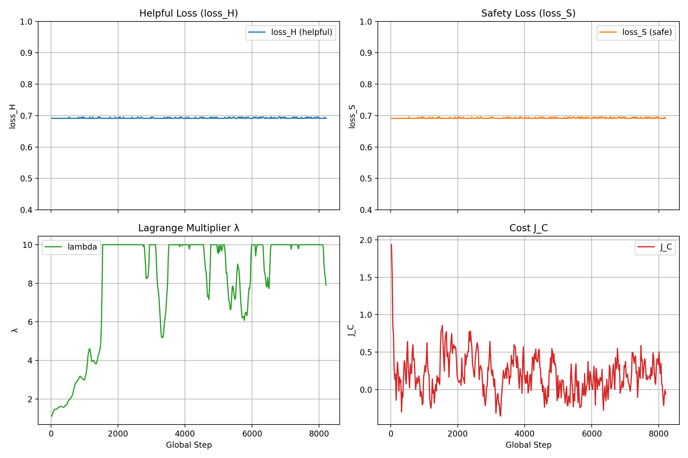
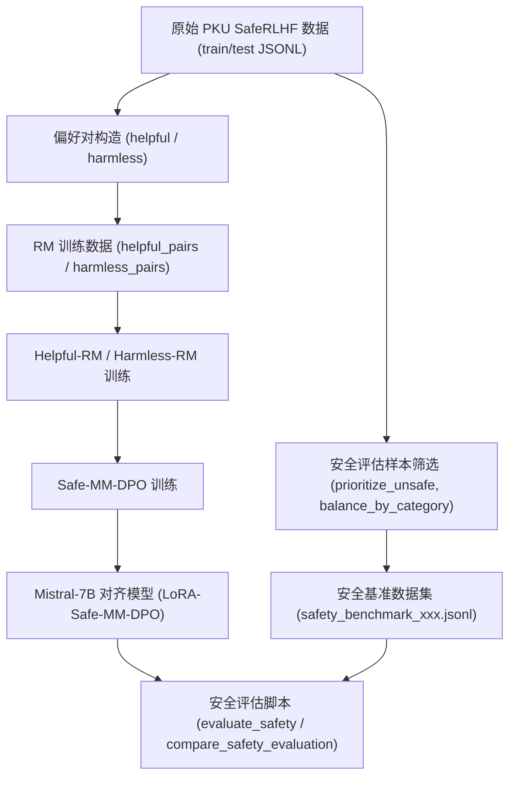

### Safe-MM-DPO价值观对齐

---

本项目旨在在有限算力条件下，将多模态 DPO（MM-DPO）与 Safe-RLHF 的拉格朗日约束思想结合，对基座模型 Mistral‑7B 进行人类价值观对齐，并系统评估对齐前后模型的安全性表现。

#### 一、实现方法：MM‑DPO 与 Safe‑RLHF 的结合与改进

本项目的策略学习遵循「**双 Reward Model + MM‑DPO + 拉格朗日乘子 $\lambda$**」的总体框架： 
一方面使用 Helpful‑RM 优化有用性奖励，另一方面使用 Harmless‑RM 约束有害性成本，并在 DPO 框架中引入 MM‑DPO 的动态缩放因子 $\beta(\delta)$，同时按照 Safe‑RLHF 的思路对 $\lambda$ 做自适应更新。

1. **MM‑DPO 目标函数与动态缩放 $\beta(\delta)$** 
   在标准 DPO 中，策略损失可以写为  
   $$
   \mathcal{L}_\text{DPO}(\theta)
   = -\mathbb{E}_{(x,y^+,y^-)}
   \left[
     \log \sigma\Big(
       \beta\big[
         (r_\theta(x,y^+) - r_\theta(x,y^-))
         - (r_\text{ref}(x,y^+) - r_\text{ref}(x,y^-))
       \big]
     \Big)
   \right],
   $$
   其中 $r_\theta$ 为当前策略的 log‑prob 奖励，$r_\text{ref}$ 为参考模型奖励。 
   MM‑DPO 进一步根据 reward margin $\delta$ 动态调整缩放因子：
   $$
   \beta(\delta)
   = \beta_{\mathrm{ori}}\Big(1 + w\big(1 - e^{-k\delta}\big)\Big), \quad
   \delta = r_\theta(x,y^+) - r_\theta(x,y^-),
   $$
   并约束 $\beta(\delta) \in [\beta_{\mathrm{ori}},(1+w)\beta_{\mathrm{ori}}]$， 
   使「高置信度样本」在训练中获得更大权重，从而提升样本利用效率和稳定性。

2. **Safe‑RLHF 风格的成本约束与 $\lambda$ 更新** 
   为刻画有害性，本项目将 Harmless‑RM 视作 **Cost Model**，其输出记为 $C_\theta(x,y)$。 
   定义期望成本的指数滑动平均：
   $$
   J_C^\mathrm{ema} \approx \mathbb{E}[C_\theta(x,y)],
   $$
   并结合成本阈值 \(d\)（即配置中的 `cost_threshold`），形成约束项  
   $$
   J_C = J_C^\mathrm{ema} + d.
   $$
   本项目在实现中遵循 Safe‑RLHF / PKU‑Alignment 的 PPO‑Lag 思路，将拉格朗日乘子 $\lambda$ 放在 log 空间更新：
   $$
   \log \lambda_{t+1}
   = \log \lambda_t + \alpha \lambda_t \big(J_C^\mathrm{ema} - d\big),
   $$
   其中 $\alpha$ 为 `λ_lr`。代码中先维护 `lambda_log`，再通过  
   $$
   \lambda_{t+1} = \exp(\log \lambda_{t+1})
   $$
   并限制在 $[\lambda_\mathrm{min}, \lambda_\mathrm{max}]$ 区间内（如 $[10^{-6},10]$），同时保留「增长意图」：当 $\lambda$ 被上界裁剪而 $J_C^\mathrm{ema} - d > 0$ 时，只裁剪数值但不强行重置 `lambda_log`，以便在成本后续下降时能快速回调。这一实现细节在 `train_safe_mm_dpo.py` 中有详细注释说明。

3. **双 Reward Model 与联合目标** 
   策略损失由 Helpful‑RM 的 DPO 损失 $\mathcal{L}_H$ 与 Harmless‑RM 的「安全 DPO 损失」$\mathcal{L}_S$ 共同组成：
   $$
   \mathcal{L}(\theta,\lambda)
   = \mathcal{L}_H(\theta) + \lambda \,\mathcal{L}_S(\theta),
   $$
   其中 $\lambda$ 动态地在训练过程中调节 helpful 与 harmless 两个维度的权衡，使模型在提升有用性时又不过度牺牲安全性。

4. **LoRA‑Safe‑MM‑DPO 的参数高效实现** 
   在参数层面，本项目使用 LoRA 对策略模型和 Reward Model 进行微调，仅为注意力与 MLP 若干投影层引入秩为 \(r\) 的低秩适配矩阵。与完整 finetune 相比，LoRA 可将可训练参数数目降低到原模型的约 3%~5%，在 7B 模型规模下，显著减少了显存占用和优化器状态开销，使得在 8×64GB GPU 的资源约束下仍能完成 Safe‑MM‑DPO 训练。

#### 二、实现过程与算力约束

整个训练在 8 张 64GB GPU 的资源组上完成。为了在有限算力和时间内完成 Safe‑MM‑DPO 训练，本项目在策略和 RM 训练阶段均采用 LoRA 方式，仅微调局部权重，从而牺牲部分上限性能换取可行的训练开销。

1. **Reward Model 训练**  
   - Helpful‑RM 与 Harmless‑RM 均以 Mistral‑7B 为基座，采用 LoRA 微调。  
   - 每个 RM 训练了 **3 个 epoch**，使用事先构造的偏好对数据集，并在验证集上监控 loss 与 accuracy。  
   - LoRA rank 设置在 16–32 之间，`alpha` 同步放大，以维持有效表达能力。

2. **Safe‑MM‑DPO 策略训练**  
   - 策略模型与参考模型同为 `Mistral-7B-v0.1`，以 LoRA 形式进行 DPO 微调。  
   - Safe‑MM‑DPO 主训练运行 **2 个 epoch**。  
   - 由于总训练步数有限，根据训练日志中 $\lambda$ 与 $J_C^\mathrm{ema}$ 的轨迹判断，$\lambda$ 尚未完全收敛，但已经表现出响应成本变化、逐步提升安全性的趋势。

3. **资源与时间的折中** 
   随着训练进程推进，实例创建和大规模计算资源调度的时间成本显著上升。为控制整体项目周期，本项目最终选择在相对保守的训练轮数下停止 Safe‑MM‑DPO 训练，并在评估阶段引入独立训练的安全评价模型作为 Harmless‑RM，从而在不进一步加大训练成本的前提下完成对齐效果验证。

#### 三、训练日志可视化与参数曲线分析

本项目使用 `train_20251229_175835.log` 生成了 Safe‑MM‑DPO 训练过程中关键参数的演化曲线，包含 $\text{loss}_H$、$\text{loss}_S$、$\lambda$ 与 $J_C$ 四条曲线，结果如下图所示：



从图中可以观察到：

1. $J_C$ 曲线的整体形态与 Safe‑RLHF 论文中给出的成本曲线高度一致：  
   - 训练初期 $J_C$ 明显高于 0，随后在拉格朗日乘子约束下逐步下降，并在 0 附近上下小幅波动；  
   - 这种「先快速下降、后在阈值附近震荡」的行为，说明成本约束确实在发挥作用，模型在训练中逐渐学会降低 Harmless‑RM 评估下的有害性成本。

2. 相比之下，$\lambda$ 曲线在两个 epoch 的训练过程中仍然表现出较大的波动，尚未收敛到一个明显稳定的平衡值：  
   - 一方面，这与 **训练 epoch 数不足** 直接相关：根据 PPO‑Lag 与 Safe‑RLHF 的经验，$\lambda$ 通常需要较长时间才能在「成本高时上升、成本接近阈值时回落」的动态中达到相对平衡；  
   - 另一方面，**数据集质量与分布** 也会放大波动：当某些 batch 中高危样本密度偏高或 Harmless‑RM 的打分存在明显偏差时，短时间内 $J_C$ 的局部波动会被放大到 $\lambda$ 的更新上；  
   - 此外，**基线模型的初始形态**（即原始 Mistral‑7B 几乎不具备安全意识）导致训练早期的 $J_C$ 水平偏高，$\lambda$ 被迫进行较大幅度的调节，这也在一定程度上推迟了其收敛。

综合来看，$J_C$ 的行为已经较好地符合 Safe‑RLHF 理论预期，证明成本约束链路是通的；而 $\lambda$ 的未收敛则反映出当前训练轮数与数据条件下 Safe‑MM‑DPO 仍处于「中期动态调整阶段」，要获得更平滑、更稳定的 $\lambda$ 轨迹，需要在后续工作中继续加长训练、改进数据与 RM 质量。


#### 四、实验结果与效果评估

1. **Reward Model 性能**  
   - 在验证集上，两个 Reward Model（Helpful‑RM 与 Harmless‑RM）的准确率均约为 **70% 左右**，验证 loss 保持在中低水平。  
   - 这一数值说明 RM 已具有较好的判别能力且尚未过拟合，具备一定泛化性。  
   - 结合经验判断，在不使用 LoRA、进行全参数微调并延长训练轮数的情况下，验证准确率预计可以提升到 **75%–80%** 区间，但代价是显著增加显存与计算消耗。

2. **安全基准上的最终对齐效果** 
   在基于 PKU‑SafeRLHF 构造的安全性基准（类似 BeaverTails 风格）上，本项目使用独立训练的安全模型对对齐前后的模型进行打分，得到以下结论：  
   - 基线模型 **Mistral‑7B** 的安全分数约为 **55**（相对尺度）。从生成样例分析看，基线几乎不具备显式的安全意识，对多类有害指令往往直接给出详细回答。  
   - 经过 2 个 epoch Safe‑MM‑DPO 训练后的对齐模型，安全分数提升到约 **60**。在多个类别（如暴力、自残、隐私泄露等）上，可以观察到更频繁的拒绝回答或安全重定向行为。  
   - 鉴于 \(\lambda\) 还未充分收敛、训练步数有限，本次对齐结果可以视为 Safe‑MM‑DPO 在有限算力下的「下界性能」： 
     一方面，它已经**显著优于基线**，证明训练思路正确、确实提升了安全性； 
     另一方面，从曲线与收敛状态看，如果资源允许延长训练、适度增大 LoRA 容量或局部全参 finetune，仍有充分空间进一步提高安全分数。

3. **LoRA‑Safe‑MM‑DPO 的空间节省** 
   在 7B 模型规模下，全参数微调会引入数十亿级别的可训练参数及对应的优化器状态，而本项目的 LoRA 配置（例如 rank 16–32，仅覆盖注意力与部分 MLP 投影）带来的额外可训练参数约为原模型的 **3%–5%**。以此估算，本项目在不额外保存动量、二阶矩的前提下，相较全参数 Safe‑MM‑DPO 至少 **节省约 90% 以上的可训练参数与优化器状态空间**，这也是能在 8×64GB GPU 上完成完整实验流程的关键。

#### 五、数据集构造：训练与评估

1. **训练用偏好数据集**  
   - **来源**：基于 PKU‑Alignment/PKU‑SafeRLHF 提供的原始 JSONL 数据，包含多轮指令与多候选响应。  
   - **处理流程**：  
     - 在 `src/data_processing/data_preprocessor.py` 中，对原始记录按 helpful 与 harmless 两个维度分别筛选；  
     - 将每条记录转换为 `(prompt, chosen_response, rejected_response, dimension)` 形式的偏好对，其中 `dimension` 标记为 helpful 或 harmless；  
   - 对于 Harmless‑RM，还额外保留 `safety_labels`（如 $\{+1,-1\}$），用于在 RM 训练中加入 classification loss（即 Safe‑RLHF 论文中 Cost Model 的第二个损失项）。  
   - 最终得到 `data/train/helpful_pairs.jsonl`, `data/train/harmless_pairs.jsonl` 等文件，供 RM 和 Safe‑MM‑DPO 训练脚本直接使用。

2. **安全性评估数据集**  
   - **来源**：`data/raw/pku_saferlhf_train.jsonl` 与 `data/raw/pku_saferlhf_test.jsonl`。  
   - **构造脚本**：`scripts/prepare_safety_benchmark.py` 会：  
     - 按 prompt 聚合不同响应，基于 `harm_category` 与响应标签推断该 prompt 的潜在风险类型（如 violence、cybercrime、self‑harm 等）；  
     - 通过 `--prioritize_unsafe` 选项优先抽取在原数据中曾出现过不安全响应的提示，以提高评估集对「安全性」的敏感度；  
     - 通过 `--balance_by_category` 保证各细分有害类别在评估集中分布相对均衡。  
   - 实际使用中，本项目主要使用 **中等规模** 的评估集：  
   $$
   \texttt{data/benchmarks/safety_benchmark_medium.jsonl}
   $$
   约 500 条提示，既保证评估稳定性又方便在 GPU 上快速运行。

下图给出了从原始数据到最终安全评估的整体流程（示意）：



#### 六、开源仓库与项目使用方法

项目已完整开源于： 
`https://github.com/NephrenLuca/mmdpo-alignment.git`

典型的使用流程可以概括为以下几个阶段：

1. **环境与依赖安装**  
   - 克隆仓库，安装 Python 依赖（ `requirements.txt`）。  
   - 配置好 GPU 环境，确保支持 bfloat16 或 float16 训练。

2. **数据准备**  
   - 使用 `src/scripts/prepare_data.py` 与 `src/data_processing/data_preprocessor.py`，从 PKU‑SafeRLHF 原始数据中生成训练所需的偏好对数据集。  
   - 使用 `scripts/prepare_safety_benchmark.py` 从同一原始数据中构造安全评估基准，推荐生成 `safety_benchmark_medium.jsonl` 用于常规评估。

3. **Reward Model 训练**  
   
   - 通过 `src/training/train_rm.py`，使用 `configs/rm_config.yaml` 中的配置分别训练 Helpful‑RM 与 Harmless‑RM，例如：
     ```bash
     python3 -m src.training.train_rm \
         --config configs/rm_config.yaml \
         --task helpful \
      --output_dir models/helpful_rm
   
     python3 -m src.training.train_rm \
         --config configs/rm_config.yaml \
         --task harmless \
         --output_dir models/harmless_rm
     ```
  ```
   
4. **Safe‑MM‑DPO 策略训练**  
   
- 使用 `src/training/train_safe_mm_dpo.py` 与 `configs/dpo_config.yaml`，在 Mistral‑7B 基座上进行 2 个 epoch 的 Safe‑MM‑DPO 训练，输出如 `models/aligned/epoch_1`, `models/aligned/epoch_2` 等对齐模型目录。
  
5. **安全性评估与对比**  
   - 单模型评估可使用：
     ```bash
     python3 -m src.evaluation.evaluate_safety \
         --model_path models/aligned/epoch_2 \
         --harmless_rm_path models/harmless_rm \
         --benchmark_path data/benchmarks/safety_benchmark_medium.jsonl \
         --output_path results/safety_evaluation_epoch2.json
  ```
   - 基线与对齐模型对比评估可使用：
     ```bash
     python3 scripts/compare_safety_evaluation.py \
         --baseline_model_path models/base/Mistral-7B-v0.1 \
         --aligned_model_paths models/aligned/epoch_2 \
         --harmless_rm_path models/harmless_rm \
         --benchmark_path data/benchmarks/safety_benchmark_medium.jsonl \
         --output_dir results/safety_comparison
     ```

通过以上流程，本项目在一定的算力和时间限制下，完成了从数据构造、RM 训练、Safe‑MM‑DPO 策略对齐到安全性定量评估的完整闭环。实验结果验证了将 MM‑DPO 的动态重加权与 Safe‑RLHF 的成本约束思想相结合的有效性，也展示了 LoRA‑Safe‑MM‑DPO 在大模型对齐任务中的实用价值。

#### 七、未来改进方向

结合当前训练曲线（尤其是 $\lambda$ 与 $J_C$ 的行为）以及实验结果，本项目在未来可以从以下几个方向进一步改进：

1. **延长 Safe‑MM‑DPO 训练与多阶段调度** 
   在保持 LoRA 架构不变的前提下，适当增加 epoch 数与总步数，使 \(\lambda\) 有充分时间在成本约束下达到稳定平衡；同时可以采用分阶段学习率与 \(\lambda\) 更新步长调度（例如前期较大 \(\alpha\)，后期逐步减小），以缓和后期的波动。

2. **提升 Harmless‑RM / Helpful‑RM 的质量** 
   目前两个 RM 的验证准确率约为 $70\%$，在全参微调或更大 LoRA 容量、以及更严格的数据清洗与重采样策略下，有望提升到 $75\%\sim80\%$ 甚至更高。更精确、稳定的 RM 评分将直接减少 $J_C$ 的噪声，从而缓和 $\lambda$ 的震荡。

3. **改进数据集与采样策略** 
   通过对 PKU‑SafeRLHF 原始数据进行更细粒度的类别平衡、难例挖掘以及 curriculum 式训练（先在明显有害样本上对齐，再逐步加入边界模糊样本），可以让模型在训练早期更快地降低高危场景下的成本，从源头上降低 \(J_C\) 与 \(\lambda\) 的大幅波动。

4. **局部全参微调与更强基座模型** 
   在资源允许的情况下，可考虑在 LoRA 的基础上，对部分关键层（如最后几层 decoder block 或 safety 相关的 attention 模块）进行局部全参微调，或迁移到更强的基座模型（例如后续版本的 Mistral / Mixtral），以提升对复杂有害指令模式的表达能力与可对齐性。

5. **更丰富的安全评估与对齐目标** 
   目前安全性评估主要依赖于基于 PKU‑SafeRLHF 的单一安全打分模型。未来可以引入多判别器（多种安全 RM 或外部裁判模型）、多维度对齐指标（如 factuality、公平性）以及更贴近真实应用场景的多轮对话评估，从而在更全面的目标下进一步优化 Safe‑MM‑DPO 的训练策略。

#### 参考文献

1. Safe RLHF: Safe Reinforcement Learning from Human Feedback 
   Josef Dai, Xuehai Pan, Ruiyang Sun, Jiaming Ji, Xinbo Xu, Mickel Liu, Yizhou Wang, Yaodong Yang. 
   arXiv:2310.12773 [cs.AI].

2. MM-RLHF: The Next Step Forward in Multimodal LLM Alignment 
   Yi-Fan Zhang, Tao Yu, Haochen Tian, Chaoyou Fu, Peiyan Li, Jianshu Zeng, Wulin Xie, Yang Shi, Huanyu Zhang, Junkang Wu, Xue Wang, Yibo Hu, Bin Wen, Fan Yang, Zhang Zhang, Tingting Gao, Di Zhang, Liang Wang, Rong Jin, Tieniu Tan. 
   arXiv:2502.10391 [cs.CL].